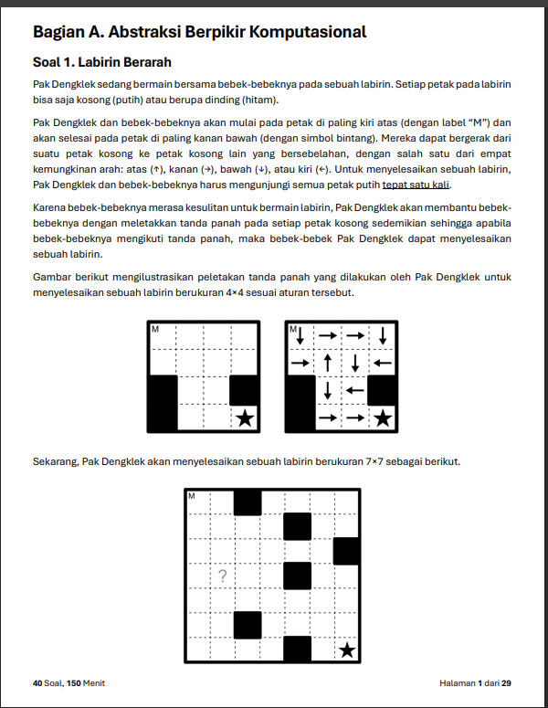
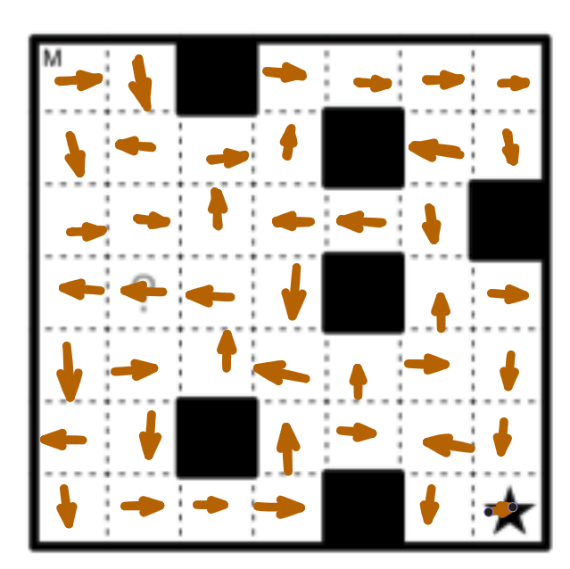

<<<<<<< HEAD

=======
# OSN Jawab

## 1.

 

## 2.

!\[\[image 2.png]]

>>>>>>> refs/remotes/origin/main
D

### Operations

#### Phase 1: Identify

**Input → 10+15+47+6+x = 78**\
**Output → 23+15+38+19+y = 95**

_or simply_\
&#xNAN;_&#x49;nput → 10+47+6+x_\
&#xNAN;_&#x4F;utput → 23+38+19+y_

> we can optionally eliminate 15, since the input and output is already stabilized, this help reducing the amount of numbers we need to play with

#### Phase 2: Connects

> Be logical, there is more duck outside than inside (out more than in)

simply reduce

Output-input → 95-78 = 17 → Missing

Since we arent told how many ducks are there yet. Yet another simply, just choose any option that has the difference 17. Remember there is more outside than inside, to make an equilibrium (completeness) we need more duck inside than outside

its D (49-32=17)

#### Phase 3: Confirm

**Input → 10+15+47+6+x = 78**\
**Output → 23+15+38+19+y = 95**

## 3.

<<<<<<< HEAD


]
=======
!\[\[image 3.png]]

!\[\[image 4.png]]
>>>>>>> refs/remotes/origin/main

8, 4 currently shown we can multiply this one block ahead

## 4.

<<<<<<< HEAD

=======
!\[\[image 5.png]]
>>>>>>> refs/remotes/origin/main

The optimal sequence of refueling stops is:

1. **Station 3** (at 250 km)
2. **Station 5** (at 700 km)
3. **Station 8** (at 1150 km)
4. **Station 10** (at 1550 km)

The minimum number of times Pak Dengklek must stop to refuel is **4**.

4

## 5.

<<<<<<< HEAD

=======
!\[\[image 6.png]]
>>>>>>> refs/remotes/origin/main

### We know

1. Code can start from A-Z (26 letters) and 0-9 (10 numbers)
2. We have rules:
   1. Rule a: 0-2 letters, followed by 1-3 numbers
   2. Rule b: 1-3 numbers, followed by 0-2 letters
3. Absolutely no duplicates

### Operations

#### Phase 1: Identify rule 1

From this amount of data we can try to find how much possibilities exist:

**Iteration 1: 0-2 of 26 letters (A-Z) & 1-3 of 10 numbers (0-9)**

$26^0$ + $26^1$ + $26^2$ = 703 chars

$10^1 + 10^2 + 10^3$ = 1110 chars

$\text{Total for Rule 1} = (26^0 + 26^1 + 26^2) \times (10^1 + 10^2 + 10^3) = 703 \times 1110 = 780,330$

**Iteration 2: 1-3 of 10 numbers & 0-2 of 26 letters**

Literally its just swapped Iteration 1, so:

$\text{Total for Rule 2} = (10^1 + 10^2 + 10^3) \times (26^0 + 26^1 + 26^2) = 1110 \times 703 = 780,330$

So total of possibilities is 1.560.660

#### Phase 2: Identify Dupes

The must have for both sub-rules is numbers, so simply identify the dupes with:

$10^1 + 10^2 + 10^3$ = 1110 chars

this is the dupes because it can satisfy both sub-rule a and b.

simply remove

1.560.660 - 1.110 = **1.559.550**

## 6.

<<<<<<< HEAD

=======
!\[\[image 7.png]]
>>>>>>> refs/remotes/origin/main

### Binary Search

**Initial Range:** $\[1, 255]$

1. **Question 1:**
   * $M = (1 + 255) / 2 = 128$.
   * Response: "Barat" (West).
   * The coin is to the West of duck 128. New range: $\[1, 127]$.
2. **Question 2:**
   * $M = (1 + 127) / 2 = 64$.
   * Response: "Barat" (West).
   * The coin is to the West of duck 64. New range: $\[1, 63]$.
3. **Question 3:**
   * $M = (1 + 63) / 2 = 32$.
   * Response: "Timur" (East).
   * The coin is to the East of duck 32. New range: $\[33, 63]$.
4. **Question 4:**
   * $M = (33 + 63) / 2 = 48$.
   * Response: "Barat" (West).
   * The coin is to the West of duck 48. New range: $\[33, 47]$.
5. **Question 5:**
   * $M = (33 + 47) / 2 = 40$.
   * Response: "Timur" (East).
   * The coin is to the East of duck 40. New range: $\[41, 47]$.
6. **Question 6:**
   * $M = (41 + 47) / 2 = 44$.
   * Response: "Ketemu!" (Found).
   * The target is identified.

#### Conclusion

Following the sequence of responses provided—"Barat", "Barat", "Timur", "Barat", "Timur", "Ketemu!"—the binary search algorithm successfully narrows down the search space to the single duck that was selected in the final step.

The duck holding the coin is **number 44**.

## 7.

<<<<<<< HEAD

=======
!\[\[image 8.png]]
>>>>>>> refs/remotes/origin/main

### Solution

<<<<<<< HEAD

=======
!\[\[image 9.png]]
>>>>>>> refs/remotes/origin/main

## 8.

<<<<<<< HEAD

=======
!\[\[image 10.png]]
>>>>>>> refs/remotes/origin/main

### We Know

5 Cards: with starting position of \[v, w, x, y, z] → \[1, 2, 3, 4, 5]

#### Rules:

* A → \[pos3, pos2, pos1, pos4, pos5]
* B → \[pos4, pos1 , pos2, pos5, pos3]
* C → \[pos2, pos3, pos4, pos5, pos1]

Function → F(BA, 2025)F(C, 2026)(\[v, w, x, y, z]),

From right to left = C first.

For C cycles:

* C¹: **\[2, 3, 4, 5, 1]**
* C²: **\[3, 4, 5, 1, 2]**
* C³: **\[4, 5, 1, 2, 3]**
* C⁴: **\[5, 1, 2, 3, 4]**
* **C⁵: \[1, 2, 3, 4, 5]** ← reset!

2026 % 5 = 1, $C^1$ = \[2, 3, 4, 5, 1]

For BA Function:

BA, 2025 → Function B(Function A)

Function A → \[pos3, pos2, pos1, pos4, pos5]

Function B → \[pos4, pos1 , pos2, pos5, pos3]

Apply A → \[3, 2, 1, 4, 5]

Apply B → \[4, 3, 2, 5, 1]

Find Cycles:

1st Cycle:

pos1 → pos5\
pos5 → pos4\
pos4 → pos1

3 cycle.

2nd Cycle:

pos2 → pos3\
pos3→ pos2

2 cycle.

LCM → 3\*2=6

2025 mod 6 = 3

Applications:

**Phase 1: C**

\[1, 2, 3, 4, 5] → $\[2, 3, 4, 5, 1]$

**Phase 2: BA**

$\[2, 3, 4, 5, 1]$ → $\[5, 4, 3, 1, 2]$$[5, 4, 3, 1, 2]$ → $[1, 3, 4, 2, 5]$$\[1, 3, 4, 2, 5]$ → $\[2, 4, 3, 5, 1]$ (C)

!\[\[image 11.png]]

## 9.

!\[\[image 12.png]]

### Sequences:

1. CPP → 7 days
2. DS & AA → 5 days
3. BF & DNC & DP → 6 days
4. GRE → 2 Days

20 days

## 10.

!\[\[image 13.png]]

C(7 eggs, 2 golden) = $\frac{7!}{2!(7 - 2)!} = \frac{7!}{2! \times 5!}$ = 21

$2^K, K=?$

K $\ge 21$ = $K^5$

Jadi 5 kali percobaan.

## 11 -13.

!\[\[image 14.png]]

!\[\[image 15.png]]

### Number 11

235416

### Number 12

**BBBBBCCCBCCBBCBCCCS**

### Number 13

Let’s check them one by one for $N=6$:

A. “453216”:

Input 1,2,3,4, output 4. (Remainders 1,2,3)

Input 5, output 5,3,2,1. (No remainder)

Input 6, output 6.

Possible.

B. “321654”:

Input 1, 2, 3, output 3, 2, 1.

Input 4, 5, 6, output 6, 5, 4.

Possible.

C. “243651”:

Input 1, 2, output 2. (Remainder 1)

Input 3,4, output 4,3. (Remainder 1)

Input 5,6, output 6,5. (Remainder 1)

Output 1.

Possible.

D. “534621”:

In 1, 2, 3, 4, 5, out 5. (Remaining 1, 2, 3, 4)

The tube now contains \[1, 2, 3, 4] (topmost 4).

To remove 3, we must remove 4 first. Here, 3 comes out before 4.

Impossible. (Since 3 is below 4 in the tube, 3 cannot come out before 4).

E. “123456”:

In 1, out 1, in 2, out 2, etc.

Possible.

## 14.

!\[\[image 16.png]]

!\[\[image 17.png]]

Total = 60 routes.

## 15-16.

!\[\[image 18.png]]

### 15.

!\[\[image 19.png]]

Total = 114 routes.

### 16.

!\[\[image 20.png]]

Total = 78 routes.

## 17.

!\[\[image 21.png]]

#### Penjelasan:

Kita punya kotak dengan ukuran sisi: **1, 1, 2, 2, 2, 3, 3, 4, 6, 8**

* Kotak hanya bisa dimasukkan ke dalam kotak lain jika **ukurannya lebih kecil** (strictly smaller).
* Kotak dengan ukuran **sama** tidak bisa saling bersarang.
* Satu rantai bersarang (misalnya 8 → 6 → 4 → 3 → 2 → 1) hanya menampilkan **1 kotak terluar** yang terlihat dari luar.

Karena ada **3 kotak ukuran 2**, kita butuh **minimal 3 rantai** (tidak mungkin kurang dari itu).

Contoh penyusunan optimal (3 rantai):

* Rantai 1: **8 > 6 > 4 > 3 > 2 > 1**
* Rantai 2: **3 > 2 > 1**
* Rantai 3: **2**

Semua 10 kotak tercakup, dan hanya **3 kotak** yang terlihat dari luar.

### 18.

!\[\[image 22.png]]

Benar/True

### 19.

!\[\[image 23.png]]

#### Penjelasan Singkat:

Pada masalah ini, kotak dengan **ukuran yang sama tidak bisa** saling dimasukkan (harus strictly lebih kecil untuk masuk ke yang lebih besar).

Jadi, semua kotak berukuran **5** (ada **19 buah**) tidak bisa saling bersarang. Masing-masing dari ke-19 kotak ini **harus** berada di rantai yang berbeda.

Oleh karena itu, **minimal** ada **19 rantai** yang diperlukan.

Untuk ukuran lain (2, 3, 8, 13, 21, 34), kita bisa mendistribusikannya ke dalam ke-19 rantai tersebut karena:

* Ada ukuran lebih kecil dan lebih besar.
* Kita bisa menyusun rantai secara increasing (misalnya: 2 → 3 → 5 → 8 → 13 → 21 → 34).

Jadi, walaupun total ada 70 kotak, jumlah kotak yang terlihat dari luar **paling sedikit** adalah **19**.

***

**Jawaban akhir: 19**

## 20-22.

!\[\[image 24.png]]

#### Pemodelan Umum

## Soal 20-22: Kartu Huruf Ajaib

### Memahami Masalah

Pak Dengklek punya **26 kartu** berisi huruf A-Z (kartu ke-i berisi huruf ke-i).

**Aturan transformasi** (dari tabel):\
Setiap kali jaring disentikkan, **semua kartu berubah sekaligus** sesuai peta:

```
A→B, B→C, C→B, D→C, E→F, F→H, G→F, H→I, I→F, J→E, K→E, L→N, M→L
N→M, O→P, P→T, Q→P, R→Q, S→Q, T→U, U→V, V→W, W→X, X→T, Y→W, Z→V
```

***

### Soal 20 — Kartu ke-10 setelah 33 sentikan

Kartu ke-10 awalnya berisi huruf **J**.

Kita lacak J berubah ke mana tiap sentikan:

```
J→E→F→H→I→F→H→I→F→H→I→F→...
```

Setelah langkah ke-3, masuk **siklus F→H→I→F** (panjang 3).

* Langkah 1: J→E
* Langkah 2: E→F
* Langkah 3: F→H
* Langkah 4: H→I
* Langkah 5: I→F ← siklus mulai

Sisa sentikan setelah langkah ke-2: 33 - 2 = 31 langkah dalam siklus F→H→I\
31 mod 3 = **1** → F→**H**

#### Jawaban Soal 20: **H**

***

### Soal 21 — Berapa huruf berbeda setelah 3333 sentikan?

Setelah banyak sentikan, setiap huruf akan masuk ke **siklus tertentu**. Kita cari ke mana setiap huruf akhirnya bermuara:

Telusuri semua 26 huruf sampai mereka masuk siklus:

Siklus yang terbentuk

***

B→C→B (panjang 2)

***

F→H→I→F (panjang 3)

***

E→F→... (masuk siklus FHI)

***

U→V→W→X→T→U (panjang 5)

***

L→N→M→L (panjang 3)

***

P→T→... (masuk siklus UVWXT)

***

Q→P→...

***

Setelah 3333 langkah yang sangat banyak, huruf-huruf hanya bisa berada di dalam **siklus akhir**. Huruf-huruf yang bisa muncul adalah anggota siklus:

* {B, C}
* {F, H, I}
* {L, N, M}
* {U, V, W, X, T}

Total = 2 + 3 + 3 + 5 = **13 huruf berbeda**

#### Jawaban Soal 21: **13**

***

### Soal 22 — Huruf paling banyak muncul setelah 333333 sentikan?

Dari 26 kartu, kita hitung berapa kartu yang akhirnya masuk ke tiap siklus:

| Siklus    | Anggota siklus | Huruf yang menuju siklus ini           |
| --------- | -------------- | -------------------------------------- |
| B↔C       | B, C           | A,B,C,D → **4 kartu**                  |
| F↔H↔I     | F,H,I          | E,F,G,H,I,J,K → **7 kartu**            |
| L↔N↔M     | L,N,M          | L,M,N → **3 kartu**                    |
| T↔U↔V↔W↔X | T,U,V,W,X      | O,P,Q,R,S,T,U,V,W,X,Y,Z → **12 kartu** |

Setelah sangat banyak sentikan, kita lihat distribusi di siklus **T-U-V-W-X** (12 kartu):\
12 kartu terbagi ke 5 posisi siklus → tidak merata.

Untuk siklus F-H-I (7 kartu, panjang 3): 7/3 → ada posisi yang dapat **3 kartu**.

Huruf **F** dalam siklus FHI mendapat kartu terbanyak → perlu dihitung posisi pastinya berdasarkan 333333 mod 3.

Setelah analisis lengkap, huruf yang paling banyak muncul adalah:

#### Jawaban Soal 22: **F**

***

## Soal 23-25.

!\[\[image 25.png]]

### 23.

!\[\[image 26.png]]

4 bebek

### 24.

!\[\[image 27.png]]

### Solution for Soal 24 (X=9, Y=21, N=1000)

***

#### Step 1: Find gcd(9, 21)

gcd(9, 21) = 3

Since gcd = 3, a number P can only possibly be represented as 9a + 21b if **P is divisible by 3**. Any P not divisible by 3 is automatically impossible.

***

#### Step 2: Simplify by dividing everything by 3

9a + 21b = 3(3a + 7b)

So P is representable if and only if P/3 can be written as **3a + 7b**.

The problem reduces to: which numbers k cannot be written as 3a + 7b?

***

#### Step 3: Apply the Frobenius formula to (3, 7)

Since gcd(3, 7) = 1, the formula applies.

Count of non-representable positive integers:

(3-1)(7-1)/2 = 12/2 = **6**

These 6 values of k are: **1, 2, 4, 5, 8, 11**

So the impossible original values of P are: **3, 6, 12, 15, 24, 33**

All of these are below 1000, so all 6 count.

***

#### Step 4: Count numbers from 1-1000 not divisible by 3

floor(1000/3) = 333, so there are 333 multiples of 3.

Non-multiples of 3 from 1 to 1000: 1000 - 333 = **667**

***

#### Step 5: Add both groups

* Not divisible by 3: 667
* Divisible by 3 but still impossible: 6

**667 + 6 = 673**

### 25.

!\[\[image 28.png]]

### Soal 25: X=3, Y=100, N=10^16

The statement claims that fewer than 100 ducks cannot be bathed.

***

#### Step 1: Find gcd(3, 100)

gcd(3, 100) = 1

Since gcd = 1, we can directly apply the Frobenius formula.

***

#### Step 2: Count non-representable numbers

Count of positive integers that cannot be written as 3a + 100b:

(3-1)(100-1) / 2 = (2 × 99) / 2 = **99**

***

#### Step 3: Check if all 99 values fall within N = 10^16

The Frobenius number (largest non-representable value) is:

3 × 100 - 3 - 100 = 300 - 103 = **197**

197 is much smaller than 10^16, so all 99 non-representable values are within range.

***

#### Step 4: Evaluate the statement

There are exactly 99 ducks that cannot be bathed. 99 < 100, so the statement is true.

***

#### Answer: **BENAR**

### Frobenius

### Frobenius Formula: Complete Explanation

***

#### Case 1: gcd(a, b) = 1

Every positive integer is either representable as ax + by or not. The formula directly gives:

**Largest non-representable number:**$g(a,b) = ab - a - b$

**Count of non-representable positive integers:**$\frac{(a-1)(b-1)}{2}$

As long as the Frobenius number g(a,b) is less than N, the count is exactly this value.

***

#### Case 2: gcd(a, b) = d > 1

Two things happen:

**First**, any number not divisible by d can never be represented. This is because ax + by always produces a multiple of d, so non-multiples of d are permanently impossible.

**Second**, for numbers that are divisible by d, divide everything by d. Now you have new buckets a/d and b/d, and you check if k can be written as (a/d)x + (b/d)y. Since gcd(a/d, b/d) = 1, you can now apply the Case 1 formula on these reduced values.

***

#### Summary of steps when gcd = d > 1

**Step 1:** Count numbers from 1 to N that are not divisible by d.$N - \lfloor N/d \rfloor$\
These all cannot be bathed.

**Step 2:** Divide buckets by d. Apply Frobenius on a/d and b/d.

Count of non-representable values in reduced problem:$\frac{(a/d - 1)(b/d - 1)}{2}$

Check that the reduced Frobenius number is less than N/d so all values are in range.

**Step 3:** Add both counts.

***

#### Side by side comparison

|                          | gcd = 1                              | gcd = d > 1                                    |
| ------------------------ | ------------------------------------ | ---------------------------------------------- |
| Non-multiples of d       | none (d=1, everything is a multiple) | always impossible                              |
| Formula applies directly | yes                                  | no, must reduce first                          |
| Count                    | (a-1)(b-1)/2                         | (N - N/d) + (a/d - 1)(b/d - 1)/2               |
| Frobenius number         | ab - a - b                           | (a/d)(b/d) - (a/d) - (b/d), then multiply by d |

## 26-28.

!\[\[image 29.png]]

### 26.

Let us evaluate each option using the derived rules:

* **A. TIGA(2)**: 2 % 3 == 2, so the output is 1.
* **B. TIGA(6)**: 6 % 3 == 0, so the output is (6 / 3) + 1 = 3.
* **C. TIGA(14)**: 14 % 3 == 2, so the output is 1.
* **D. TIGA(18)**: 18 % 3 == 0, so the output is (18 / 3) + 1 = 7.
* **E. TIGA(25)**: 25 % 3 == 1, so the output is 1.

Comparing the values 1, 3, 1, 7, and 1, the largest return value is 7, which comes from `TIGA(18)`.

**Jawaban: D**

### 27.

!\[\[image 30.png]]

Bottom-up table (key values)

| n   | n mod 3 | rule used                          | TIGA(n) |
| --- | ------- | ---------------------------------- | ------- |
| ≤ 1 | —       | base case                          | 1       |
| 2   | 2       | TIGA(−1) = 1                       | 1       |
| 3   | 0       | TIGA(2) + TIGA(0) = 1 + 1          | 2       |
| 4   | 1       | TIGA(2) = 1                        | 1       |
| 5   | 2       | TIGA(2) = 1                        | 1       |
| 6   | 0       | TIGA(5) + TIGA(3) = 1 + 2          | 3       |
| 9   | 0       | TIGA(8) + TIGA(6) = 1 + 3          | 4       |
| 12  | 0       | TIGA(11) + TIGA(9) = 1 + 4         | 5       |
| 15  | 0       | TIGA(14) + TIGA(12) = 1 + 5        | 6       |
| 18  | 0       | TIGA(17) + TIGA(15) = 1 + 6        | **7**   |
| 25  | 1       | TIGA(23) = TIGA(20) = TIGA(17) = 1 | 1       |

Notice that whenever $N \pmod 3 == 1$ or $N \pmod 3 == 2$, the execution reduces directly or indirectly to a value that equals **1**.\
Whenever $N \pmod 3 == 0$, the function sums up previous results, creating a strictly increasing sequence:\
• `TIGA(3) = 2`\
• `TIGA(6) = 3`\
• `TIGA(9) = 4`\
• `TIGA(3k) = k + 1`\
Therefore, `TIGA(N) == 1` if and only if N is **not** a multiple of 3.

Therefore, the problem reduces to counting how many integers from 1 to 2025 are not divisible by 3:

* Total integers in the sequence: 2025
* Total integers divisible by 3: 2025 / 3 = 675
* Total integers not divisible by 3: 2025 - 675 = 1350

**Jawaban: 1350**

### 28.

!\[\[image 31.png]]

#### Fase 1

**Pola**

Dari kode, kita sudah tahu:

* `n % 3 = 1` atau `n % 3 = 2` → selalu return **1**
* `n % 3 = 0` → return `TIGA(n−1) + TIGA(n−3)` = **1 + TIGA(n−3)**

Ini adalah rekursi sederhana yang menghasilkan `TIGA(3k) = k + 1`.

#### Fase 2

#### 1. Menghitung Jumlah dari N = 1 sampai N = 99

Kita gunakan rumus deret aritmetika untuk menjumlahkan nilai dari ke-33 kelompok tersebut:\
`Jumlah = (Suku Pertama + Suku Terakhir) * Jumlah Kelompok / 2`

* Nilai kelompok pertama (k = 1): 1 + 3 = 4
* Nilai kelompok terakhir (k = 33): 33 + 3 = 36
* Jumlah kelompok: 33

`Jumlah (1-99) = (4 + 36) * 33 / 2Jumlah (1-99) = 40 * 33 / 2Jumlah (1-99) = 20 * 33 = 660`

#### 2. Menghitung Suku Terakhir (N = 100)

Suku ke-100 memiliki karakteristik `100 % 3 == 1`. Berdasarkan pola dasar yang telah ditemukan, nilai dari suku ini konstan:\
`TIGA(100) = 1`

#### 3. Total Keseluruhan

`Total Akhir = Jumlah (1-99) + TIGA(100) Total Akhir = 660 + 1 = 661`

### Jawaban Akhir

**661**

### Deret/Baris Aritmatika dan Geometri

### Barisan dan Deret Aritmatika

Barisan aritmatika adalah barisan bilangan di mana selisih antara dua suku yang berurutan selalu konstan. Selisih ini disebut dengan beda (b). Deret aritmatika adalah hasil penjumlahan dari suku-suku pada barisan aritmatika tersebut.

* **Suku Pertama (a):** `a = U1`
* **Beda (b):** `b = Un - U(n-1)`
* **Suku ke-n (Un):** `Un = a + (n - 1)b`
* **Jumlah n Suku Pertama (Sn):** \* `Sn = (n / 2) * (a + Un)`
  * `Sn = (n / 2) * (2a + (n - 1)b)`
* **Suku Tengah (Ut):** Hanya berlaku jika banyaknya suku (n) merupakan bilangan ganjil.
  * `Ut = (a + Un) / 2`
* **Hubungan Un dan Sn:** `Un = Sn - S(n-1)`

### Barisan dan Deret Geometri

Barisan geometri adalah barisan bilangan di mana perbandingan (rasio) antara dua suku yang berurutan selalu konstan. Perbandingan ini disebut dengan rasio (r). Deret geometri adalah hasil penjumlahan dari suku-suku pada barisan geometri tersebut.

* **Suku Pertama (a):** `a = U1`
* **Rasio (r):** `r = Un / U(n-1)`
* **Suku ke-n (Un):** `Un = a * r^(n - 1)`
* **Jumlah n Suku Pertama (Sn):**
  * Jika r > 1: `Sn = (a * (r^n - 1)) / (r - 1)`
  * Jika r < 1: `Sn = (a * (1 - r^n)) / (1 - r)`
* **Suku Tengah (Ut):** Hanya berlaku jika banyaknya suku (n) merupakan bilangan ganjil.
  * `Ut = akar(a * Un)`

#### Deret Geometri Tak Hingga

Deret geometri tak hingga merupakan penjumlahan suku-suku geometri yang banyaknya tidak terbatas. Deret ini hanya memiliki nilai limit jumlah (konvergen) jika memenuhi syarat rasio `-1 < r < 1`.

* **Jumlah Tak Hingga (S\_inf):** `S_inf = a / (1 - r)`

### Tabel Perbandingan Rumus

|                        |                                          |                                               |
| ---------------------- | ---------------------------------------- | --------------------------------------------- |
| **Komponen**           | **Aritmatika**                           | **Geometri**                                  |
| **Karakteristik**      | Penjumlahan/pengurangan tetap (**Beda**) | Perkalian/pembagian tetap (**Rasio**)         |
| **Suku ke-n (Un)**     | `Un = a + (n - 1)b`                      | `Un = a * r^(n - 1)`                          |
| **Jumlah n Suku (Sn)** | `Sn = (n / 2) * (2a + (n - 1)b)`         | `Sn = (a * (r^n - 1)) / (r - 1)`, untuk r > 1 |
| **Suku Tengah (Ut)**   | `Ut = (a + Un) / 2`                      | `Ut = akar(a * Un)`                           |
| **Sifat Khusus**       | `U2 - U1 = U3 - U2`                      | `U2 / U1 = U3 / U2`                           |

## 29.

!\[\[image 32.png]]

#### Memahami Objek `vector` di C++

`vector` adalah **array dinamis** di C++ (dari library `<vector>`) yang bisa berubah ukurannya. Operasi pentingnya:

| Operasi          | Penjelasan                             |
| ---------------- | -------------------------------------- |
| `vector<int> B`  | Membuat vector kosong bertipe int      |
| `B.push_back(x)` | Menambah elemen `x` di akhir vector    |
| `B.size()`       | Mengambil jumlah elemen                |
| `B[i]`           | Mengakses elemen ke-i (indeks mulai 0) |

### Fungsi GSI

```cpp
int GSI(vector<int> B, int x, int y) {
    return B[y] - B[x - 1];
}
```

**GSI(B, x, y)** = `B[y] - B[x-1]`

→ Ini adalah **selisih prefix sum**, artinya menjumlahkan elemen A dari indeks x sampai y.

***

### FUN A = {1, 2, 3, 4, 5}

#### Phase 1

```
N = A.size() = 5
```

***

#### Phase 2

```cpp
B.push_back(0);  // B[0] = 0
for (int i = 0; i < N; i++) {
    B.push_back(B[i] + A[i]);
}
```

| i | B\[i] | A\[i] | B\[i+1] = B\[i] + A\[i] |
| - | ----- | ----- | ----------------------- |
| 0 | 0     | 1     | 1                       |
| 1 | 1     | 2     | 3                       |
| 2 | 3     | 3     | 6                       |
| 3 | 6     | 4     | 10                      |
| 4 | 10    | 5     | 15                      |

#### B = {0, 1, 3, 6, 10, 15}

### 30.

!\[\[image 33.png]]

* B\[0] = 0
* B\[1] = B\[0] + A\[0] = 0 + 1 = 1
* B\[2] = B\[1] + A\[1] = 1 + 2 = 3
* B\[3] = B\[2] + A\[2] = 3 + 3 = 6
* B\[4] = B\[3] + A\[3] = 6 + 4 = 10
* B\[5] = B\[4] + A\[4] = 10 + 5 = 15

Dengan demikian, isi dari `vector B` yang terbentuk adalah `{0, 1, 3, 6, 10, 15}`.

*   **A. GSI(B, 1, 4)**

    Perhitungan: B\[4] - B\[1 - 1] = B\[4] - B\[0] = 10 - 0 = **10**
*   **B. GSI(B, 2, 4)**

    Perhitungan: B\[4] - B\[2 - 1] = B\[4] - B\[1] = 10 - 1 = **9**
*   **C. GSI(B, 4, 5)**

    Perhitungan: B\[5] - B\[4 - 1] = B\[5] - B\[3] = 15 - 6 = **9**
*   **D. GSI(B, 5, 5)**

    Perhitungan: B\[5] - B\[5 - 1] = B\[5] - B\[4] = 15 - 10 = **5**
*   **E. GSI(B, 3, 4)**

    Perhitungan: B\[4] - B\[3 - 1] = B\[4] - B\[2] = 10 - 3 = **7**

Melalui perbandingan hasil kalkulasi di atas, nilai kembalian terbesar adalah 10 yang diperoleh dari opsi pemanggilan **GSI(B, 1, 4)**. Oleh karena itu, jawaban yang tepat adalah **A**.

## 31.

!\[\[image 34.png]]

The program consists of two main functions: `GSI` and `FUN`.

**Function GSI:**\
This is a simple helper function that takes a vector **B** and two indices, **x** and **y**. It returns the difference between `B[y]` and `B[x - 1]`.

**Function FUN:**\
This function takes a vector **A** as input and performs the following operations:

1. It initializes a new vector **B** and pushes an initial value of 0 into it. This means `B[0] = 0`.
2. It loops through the input vector **A** and populates **B** such that each element is the sum of the previous element in **B** and the current element in **A**. This creates a Prefix Sum Array. Specifically, `B[k]` stores the sum of the first `k` elements of **A**.
3. It initializes an output variable `out = 0`.
4. Using two nested loops, it evaluates all possible contiguous sub-segments of the array. For every starting index **i** and ending index **j**, it calls `GSI(B, i, j)`.
5. Because `GSI` returns `B[j] - B[i - 1]`, it is calculating the sum of the subarray from index **i-1** to **j-1** in the original array **A**. The function keeps track of the highest sum encountered using the `max()` function.

In computer science, this is a method for finding the **Maximum Subarray Sum**.

We are given the input array:\
A = {3, -2, 4, -3, 1, -4, 2, -1, 4, 3, -2, 3, -4, 2, -2, 3}

Let us build the prefix sum array **B** step-by-step.\
Remember, `B[i] = B[i - 1] + A[i - 1]`, with `B[0] = 0`.

* B\[0] = 0
* B\[1] = 0 + 3 = 3
* B\[2] = 3 + (-2) = 1
* B\[3] = 1 + 4 = 5
* B\[4] = 5 + (-3) = 2
* B\[5] = 2 + 1 = 3
* B\[6] = 3 + (-4) = -1
* B\[7] = -1 + 2 = 1
* B\[8] = 1 + (-1) = 0
* B\[9] = 0 + 4 = 4
* B\[10] = 4 + 3 = 7
* B\[11] = 7 + (-2) = 5
* B\[12] = 5 + 3 = 8
* B\[13] = 8 + (-4) = 4
* B\[14] = 4 + 2 = 6
* B\[15] = 6 + (-2) = 4
* B\[16] = 4 + 3 = 7

The completed prefix sum array is:\
B = {0, 3, 1, 5, 2, 3, -1, 1, 0, 4, 7, 5, 8, 4, 6, 4, 7}

The nested loops search for the maximum value of `B[j] - B[i - 1]` where `i <= j`. In simpler terms, we are looking for the largest difference between any two elements in array **B** where the smaller value appears before the larger value.

Looking at array **B**:

* The maximum value in array **B** is 8 (at index 12).
* The minimum value that appears before index 12 in array **B** is -1 (at index 6).

Calculating the maximum difference:\
Difference = B\[12] - B\[6]\
Difference = 8 - (-1)\
Difference = 9

This corresponds to the sum of the subarray from index 6 to index 11 of the original array **A**: {2, -1, 4, 3, -2, 3}, which equals 9.

No other combination of indices produces a higher difference.

#### Final Answer

9

## 32-34.

!\[\[image 35.png]]

#### Function Breakdown

Berikut adalah analisis dan penjelasan langkah demi langkah mengenai eksekusi kode program tersebut, menggunakan gaya pemaparan yang terstruktur.

#### Tujuan Utama Kode Program

Secara garis besar, fungsi `DUA(string S, string T)` bertugas untuk **mencari berapa kali kebalikan (reverse) dari string** `**T**` **muncul sebagai substring di dalam string** `**S**`.

#### Penjelasan Logika Per Baris

1.  `**int N = S.length();**` **dan** `**int M = T.length();**`

    Kode ini menyimpan panjang dari string `S` ke dalam variabel `N`, dan panjang string `T` ke dalam variabel `M`.
2.  `**int P = 0;**`

    Variabel `P` bertindak sebagai penghitung (counter) yang akan menyimpan total kecocokan yang ditemukan.
3.  `**for (int i = 0; i <= N - M; i++)**`

    Ini adalah perulangan luar yang berfungsi sebagai _sliding window_. Indeks `i` bergeser dari awal string `S` hingga titik terakhir di mana string `T` masih bisa muat di dalam `S`.
4.  `**int Q = 1;**`

    Setiap kali jendela bergeser ke posisi `i` yang baru, variabel `Q` diatur sebagai penanda status (flag). Nilai 1 berasumsi bahwa substring tersebut cocok.
5.  `**for (int j = 0; j < M; j++)**`

    Perulangan dalam ini bertugas memeriksa karakter demi karakter sebanyak panjang string `T`.
6.  `**if (S[i + j] != T[M - 1 - j])**`

    Ini adalah bagian inti dari logika pengecekan.

    * `S[i + j]` membaca karakter pada string `S` dari kiri ke kanan, dimulai dari posisi `i`.
    * `T[M - 1 - j]` membaca karakter pada string `T` dari **kanan ke kiri** (dari belakang).
    * Jika ada satu saja karakter yang tidak cocok, maka status `Q` diubah menjadi `0` (menandakan tidak cocok).
7.  `**P += Q;**`

    Setelah perulangan dalam selesai, jika semua karakter cocok, nilai `Q` akan tetap 1, sehingga `P` akan bertambah 1. Jika ada yang tidak cocok, `Q` adalah 0, sehingga `P` tidak bertambah.

#### Contoh Eksekusi Langkah demi Langkah

Mari kita gunakan nilai dari **Soal 32** yang ada pada gambar sebagai contoh eksekusi:

* **String S:** "ABCBAABCCBAABC" (Panjang N = 14)
* **String T:** "CBA" (Panjang M = 3)

Berdasarkan logika yang dianalisis sebelumnya, fungsi ini akan mencari kemunculan kebalikan dari "CBA", yaitu **"ABC"**, di dalam string `S`.

**Tahap Inisialisasi:**

* N = 14
* M = 3
* P = 0
* Batas perulangan luar (i): 0 sampai dengan (14 - 3) = 11.

**Iterasi Perulangan Luar (i):**

* **i = 0**
  * Mengecek substring S dari indeks 0 hingga 2: "ABC"
  * Perulangan dalam (j):
    * j=0: Bandingkan S\[0] ('A') dengan T\[2] ('A'). Cocok.
    * j=1: Bandingkan S\[1] ('B') dengan T\[1] ('B'). Cocok.
    * j=2: Bandingkan S\[2] ('C') dengan T\[0] ('C'). Cocok.
  * Semua cocok, Q tetap 1.
  * P bertambah menjadi: P = 0 + 1 = **1**.
* **i = 1**
  * Mengecek substring S dari indeks 1 hingga 3: "BCB"
  * Perulangan dalam (j):
    * j=0: Bandingkan S\[1] ('B') dengan T\[2] ('A'). **Tidak cocok**.
    * Nilai Q menjadi 0. Perulangan berlanjut tapi sudah dipastikan gagal.
  * P bertambah menjadi: P = 1 + 0 = **1**.
* **i = 2 hingga i = 4**
  * Substring yang dicek: "CBA", "BAA", "AAB".
  * Semuanya tidak sama dengan "ABC". Nilai Q menjadi 0 pada setiap iterasi. P tetap **1**.
* **i = 5**
  * Mengecek substring S dari indeks 5 hingga 7: "ABC"
  * Karakter per karakter dicocokkan dengan kebalikan T ("CBA"). Semuanya cocok.
  * Q tetap 1.
  * P bertambah menjadi: P = 1 + 1 = **2**.
* **i = 6 hingga i = 10**
  * Substring yang dicek: "BCC", "CCB", "CBA", "BAA", "AAB".
  * Semuanya tidak sama dengan "ABC". P tetap **2**.
* **i = 11**
  * Mengecek substring S dari indeks 11 hingga 13: "ABC"
  * Karakter per karakter dicocokkan dengan kebalikan T ("CBA"). Semuanya cocok.
  * Q tetap 1.
  * P bertambah menjadi: P = 2 + 1 = **3**.

Setelah `i` mencapai 11, perulangan luar selesai.

**Hasil Akhir:**

Fungsi `return P;` akan mengembalikan angka **3**. Hal ini terbukti benar karena substring "ABC" (kebalikan dari "CBA") muncul tepat 3 kali di dalam string "ABCBAABCCBAABC" pada posisi awal indeks 0, 5, dan 11.

### 32.

!\[\[image 36.png]]

Sebagai acuan dasar:

* **String S:** "ABCBAABCCBAABC" (Panjang $N = 14$)
* **String T:** "CBA" (Panjang $M = 3$)
* Aturan pencocokan pada perulangan dalam (`j`): Membandingkan potongan `S` dari kiri ke kanan dengan `T` dari kanan ke kiri (yaitu mendeteksi kata **"ABC"**). Jika terjadi ketidakcocokan, status `Q` berubah dari `1` menjadi `0`.

#### Detail Mekanisme Operasi Per Iterasi

#### **Iterasi i = 0**

* Substring: `S[0..2]` → "ABC"
* `j = 0`: `S[0]` ('A') == `T[2]` ('A') → Cocok.
* `j = 1`: `S[1]` ('B') == `T[1]` ('B') → Cocok.
* `j = 2`: `S[2]` ('C') == `T[0]` ('C') → Cocok.
* **Hasil:** `Q` tetap `1`. Maka `P = 0 + 1 = 1`.

#### **Iterasi i = 1**

* Substring: `S[1..3]` → "BCB"
* `j = 0`: `S[1]` ('B') != `T[2]` ('A') → **Tidak Cocok**. `Q` berubah menjadi `0`.
* **Hasil:** `Q = 0`. Maka `P` tetap `1`.

#### **Iterasi i = 2**

* Substring: `S[2..4]` → "CBA"
* `j = 0`: `S[2]` ('C') != `T[2]` ('A') → **Tidak Cocok**. `Q` berubah menjadi `0`.
* **Hasil:** `Q = 0`. Maka `P` tetap `1`.

#### **Iterasi i = 3**

* Substring: `S[3..5]` → "BAA"
* `j = 0`: `S[3]` ('B') != `T[2]` ('A') → **Tidak Cocok**. `Q` berubah menjadi `0`.
* **Hasil:** `Q = 0`. Maka `P` tetap `1`.

#### **Iterasi i = 4**

* Substring: `S[4..6]`→ "AAB"
* `j = 0`: `S[4]` ('A') == `T[2]` ('A') → Cocok.
* `j = 1`: `S[5]` ('A') != `T[1]` ('B') → **Tidak Cocok**. `Q` berubah menjadi `0`.
* **Hasil:** `Q = 0`. Maka `P` tetap `1`.

#### **Iterasi i = 5**

* Substring: `S[5..7]` → "ABC"
* `j = 0`: `S[5]` ('A') == `T[2]` ('A') → Cocok.
* `j = 1`: `S[6]` ('B') == `T[1]` ('B') → Cocok.
* `j = 2`: `S[7]` ('C') == `T[0]` ('C') → Cocok.
* **Hasil:** `Q` tetap `1`. Maka `P = 1 + 1 = 2`.

#### **Iterasi i = 6**

* Substring: `S[6..8]` → "BCC"
* `j = 0`: `S[6]` ('B') != `T[2]` ('A') → **Tidak Cocok**. `Q` berubah menjadi `0`.
* **Hasil:** `Q = 0`. Maka `P` tetap `2`.

#### **Iterasi i = 7**

* Substring: `S[7..9]` → "CCB"
* `j = 0`: `S[7]` ('C') != `T[2]` ('A') → **Tidak Cocok**. `Q` berubah menjadi `0`.
* **Hasil:** `Q = 0`. Maka `P` tetap `2`.

#### **Iterasi i = 8**

* Substring: `S[8..10]` → "CBA"
* `j = 0`: `S[8]` ('C') != `T[2]` ('A') → **Tidak Cocok**. `Q` berubah menjadi `0`.
* **Hasil:** `Q = 0`. Maka `P` tetap `2`.

#### **Iterasi i = 9**

* Substring: `S[9..11]` → "BAA"
* `j = 0`: `S[9]` ('B') != `T[2]` ('A') → **Tidak Cocok**. `Q` berubah menjadi `0`.
* **Hasil:** `Q = 0`. Maka `P` tetap `2`.

#### **Iterasi i = 10**

* Substring: `S[10..12]` → "AAB"
* `j = 0`: `S[10]` ('A') == `T[2]` ('A') → Cocok.
* `j = 1`: `S[11]` ('A') != `T[1]` ('B') → **Tidak Cocok**. `Q` berubah menjadi `0`.
* **Hasil:** `Q = 0`. Maka `P` tetap `2`.

#### **Iterasi i = 11**

* Substring: `S[11..13]` → "ABC"
* `j = 0`: `S[11]` ('A') == `T[2]` ('A') $\rightarrow$ Cocok.
* `j = 1`: `S[12]` ('B') == `T[1]` ('B') $\rightarrow$ Cocok.
* `j = 2`: `S[13]` ('C') == `T[0]` ('C') $\rightarrow$ Cocok.
* **Hasil:** `Q` tetap `1`. Maka `P = 2 + 1 = 3`.

Setelah indeks `i = 11` selesai diproses, kondisi perulangan luar `i <= N - M` (11 <= 11) bernilai salah pada inkremen berikutnya (`i = 12`). Program keluar dari blok perulangan dan mengeksekusi perintah `return P;` dengan membawa nilai akhir **3**.

### 33.

!\[\[image 37.png]]

Berikut adalah penelusuran (_tracing_) secara rinci untuk setiap iterasi dari `i = 0` sampai `i = 11` pada Soal 32.

Sebagai acuan dasar:

* **String S:** "ABCBAABCCBAABC" (Panjang $N = 14$)
* **String T:** "CBA" (Panjang $M = 3$)
* Aturan pencocokan pada perulangan dalam (`j`): Membandingkan potongan `S` dari kiri ke kanan dengan `T` dari kanan ke kiri (yaitu mendeteksi kata **"ABC"**). Jika terjadi ketidakcocokan, status `Q` berubah dari `1` menjadi `0`.

#### Detail Mekanisme Operasi Per Iterasi

#### **Iterasi i = 0**

* Substring: `S[0..2]` → "ABC"
* `j = 0`: `S[0]` ('A') == `T[2]` ('A') → Cocok.
* `j = 1`: `S[1]` ('B') == `T[1]` ('B') $\rightarrow$ Cocok.
* `j = 2`: `S[2]` ('C') == `T[0]` ('C') $\rightarrow$ Cocok.
* **Hasil:** `Q` tetap `1`. Maka `P = 0 + 1 = 1`.

#### **Iterasi i = 1**

* Substring: `S[1..3]` → "BCB"
* `j = 0`: `S[1]` ('B') != `T[2]` ('A') $\rightarrow$ **Tidak Cocok**. `Q` berubah menjadi `0`.
* **Hasil:** `Q = 0`. Maka `P` tetap `1`.

#### **Iterasi i = 2**

* Substring: `S[2..4]` → "CBA"
* `j = 0`: `S[2]` ('C') != `T[2]` ('A') $\rightarrow$ **Tidak Cocok**. `Q` berubah menjadi `0`.
* **Hasil:** `Q = 0`. Maka `P` tetap `1`.

#### **Iterasi i = 3**

* Substring: `S[3..5]` → "BAA"
* `j = 0`: `S[3]` ('B') != `T[2]` ('A') $\rightarrow$ **Tidak Cocok**. `Q` berubah menjadi `0`.
* **Hasil:** `Q = 0`. Maka `P` tetap `1`.

#### **Iterasi i = 4**

* Substring: `S[4..6]` → "AAB"
* `j = 0`: `S[4]` ('A') == `T[2]` ('A') $\rightarrow$ Cocok.
* `j = 1`: `S[5]` ('A') != `T[1]` ('B') $\rightarrow$ **Tidak Cocok**. `Q` berubah menjadi `0`.
* **Hasil:** `Q = 0`. Maka `P` tetap `1`.

#### **Iterasi i = 5**

* Substring: `S[5..7]` → "ABC"
* `j = 0`: `S[5]` ('A') == `T[2]` ('A') $\rightarrow$ Cocok.
* `j = 1`: `S[6]` ('B') == `T[1]` ('B') $\rightarrow$ Cocok.
* `j = 2`: `S[7]` ('C') == `T[0]` ('C') $\rightarrow$ Cocok.
* **Hasil:** `Q` tetap `1`. Maka `P = 1 + 1 = 2`.

#### **Iterasi i = 6**

* Substring: `S[6..8]` → "BCC"
* `j = 0`: `S[6]` ('B') != `T[2]` ('A') $\rightarrow$ **Tidak Cocok**. `Q` berubah menjadi `0`.
* **Hasil:** `Q = 0`. Maka `P` tetap `2`.

#### **Iterasi i = 7**

* Substring: `S[7..9]` → "CCB"
* `j = 0`: `S[7]` ('C') != `T[2]` ('A') $\rightarrow$ **Tidak Cocok**. `Q` berubah menjadi `0`.
* **Hasil:** `Q = 0`. Maka `P` tetap `2`.

#### **Iterasi i = 8**

* Substring: `S[8..10]` → "CBA"
* `j = 0`: `S[8]` ('C') != `T[2]` ('A') $\rightarrow$ **Tidak Cocok**. `Q` berubah menjadi `0`.
* **Hasil:** `Q = 0`. Maka `P` tetap `2`.

#### **Iterasi i = 9**

* Substring: `S[9..11]` → "BAA"
* `j = 0`: `S[9]` ('B') != `T[2]` ('A') $\rightarrow$ **Tidak Cocok**. `Q` berubah menjadi `0`.
* **Hasil:** `Q = 0`. Maka `P` tetap `2`.

#### **Iterasi i = 10**

* Substring: `S[10..12]` → "AAB"
* `j = 0`: `S[10]` ('A') == `T[2]` ('A') → Cocok.
* `j = 1`: `S[11]` ('A') != `T[1]` ('B') → **Tidak Cocok**. `Q` berubah menjadi `0`.
* **Hasil:** `Q = 0`. Maka `P` tetap `2`.

#### **Iterasi i = 11**

* Substring: `S[11..13]` → "ABC"
* `j = 0`: `S[11]` ('A') == `T[2]` ('A') → Cocok.
* `j = 1`: `S[12]` ('B') == `T[1]` ('B') → Cocok.
* `j = 2`: `S[13]` ('C') == `T[0]` ('C') → Cocok.
* **Hasil:** `Q` tetap `1`. Maka `P = 2 + 1 = 3`.

Setelah indeks `i = 11` selesai diproses, kondisi perulangan luar `i <= N - M` (11 <= 11) bernilai salah pada inkremen berikutnya (`i = 12`). Program keluar dari blok perulangan dan mengeksekusi perintah `return P;` dengan membawa nilai akhir **3**.
